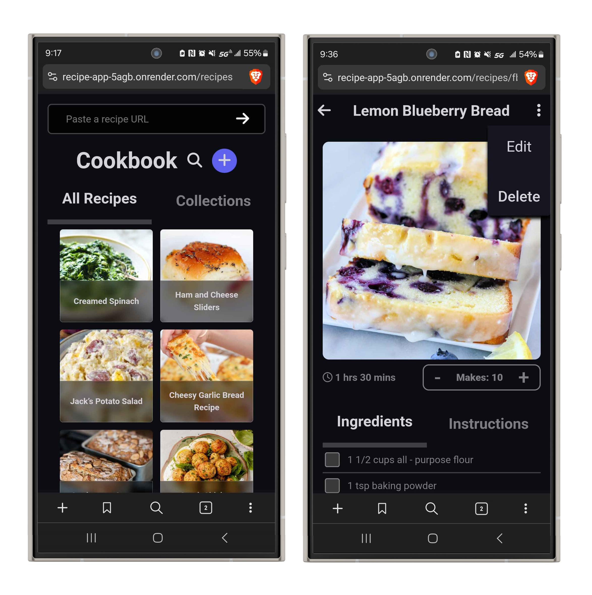

## Recipe collection App
-----------------------
Author: Christian Land

[Live Site](https://www.recipes.christianland.dev/)

-----------------------
TECHNOLOGY USED
----------------------
- Recipe-scraper package from: https://github.com/hhursev/recipe-scrapers
- JavaScript React Front-end
- Python Flask Back-end
- PostgreSQL CockRoachDB Database
- Deployed with Render
-----------------------
FEATURES
-----------------------
- [x] checklist for what ingredients/steps you have done so far
- [x] able to share recipes with other people 
- [x] form to add a recipe to your collection
    - [x] takes in a url for the website
    - [x] scrape the web page and parse out relevant data
        - [x] title of recipe
        - [x] image of the recipe
        - [x] ingredients for recipe (with quantities)
        - [x] directions/instructions for the recipe
        - [x] number of servings for the recipe
        - [x] total time for the recipe
    - [x] before saving to your collection, you will have a chance to edit the scraped data in case there is anything missing or incorrect
- [x] recipe calculator (adjust ingredient amounts based on desired number of servings)
- [ ] be able to categorize your recipes into custom categories/labels for organization
    - [ ] labels for things like type of food, what culture its from, main ingredient, etc
- [x] search saved recipes by title
